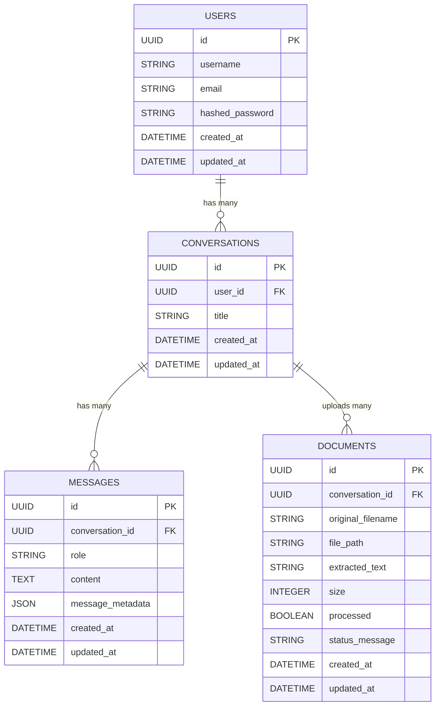

```mermaid
erDiagram

    USERS {
        UUID id PK
        STRING username
        STRING email
        STRING hashed_password
        DATETIME created_at
        DATETIME updated_at
    }

    CONVERSATIONS {
        UUID id PK
        UUID user_id FK
        STRING title
        DATETIME created_at
        DATETIME updated_at
    }

    MESSAGES {
        UUID id PK
        UUID conversation_id FK
        STRING role
        TEXT content
        JSON message_metadata
        DATETIME created_at
        DATETIME updated_at
    }

    DOCUMENTS {
        UUID id PK
        UUID conversation_id FK
        STRING original_filename
        STRING file_path
        STRING extracted_text
        INTEGER size
        BOOLEAN processed
        STRING status_message
        DATETIME created_at
        DATETIME updated_at
    }

    USERS ||--o{ CONVERSATIONS : "has many"
    CONVERSATIONS ||--o{ MESSAGES : "has many"
    CONVERSATIONS ||--o{ DOCUMENTS : "uploads many"

```
